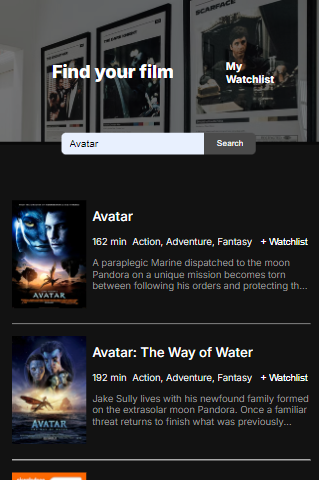

# Movie Watchlist Website 

Website which allows you to search/browse through movies, and add movies to your watchlist

- Website requests movie data from OMDB Api, processes it into json format, and renders it to the website page. 
- Movies you add are saved to local storage. Users can add and remove movies from their watchlist. 
- Website is made using media queries which allow, for website to fit mobile screens as well as desktop screens. 

